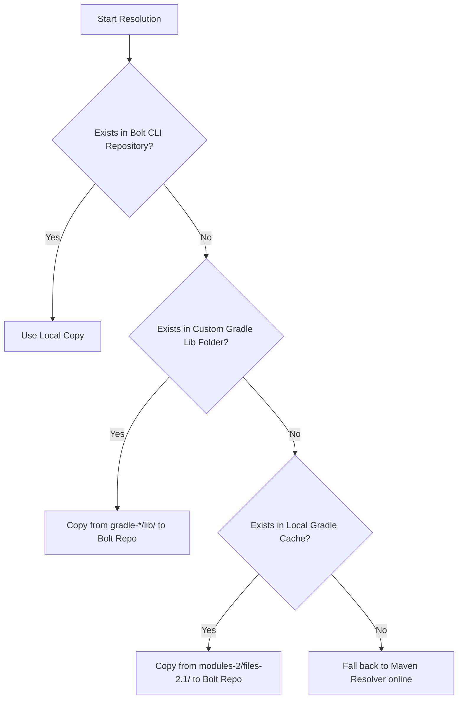
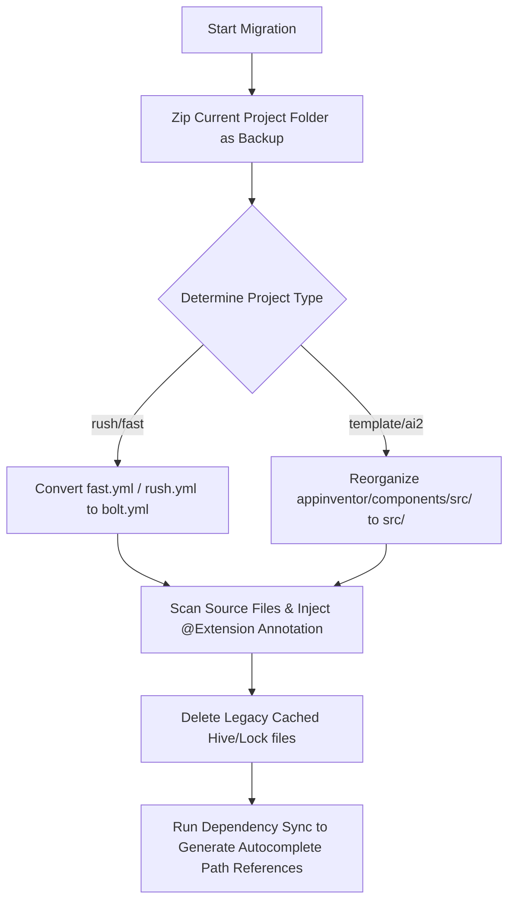
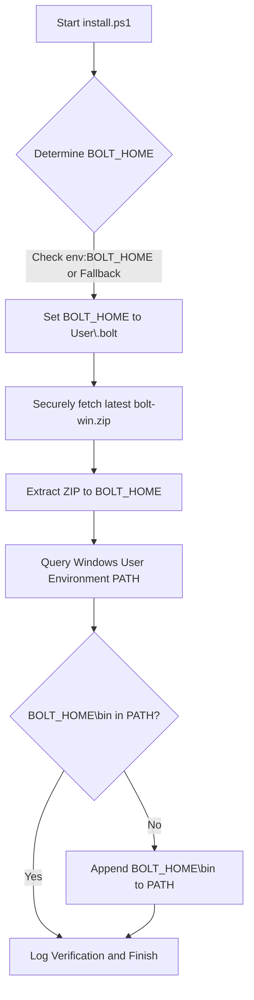
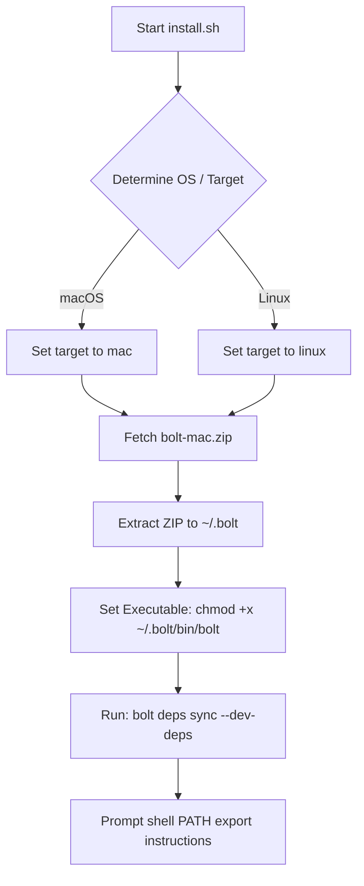

# 🚀 Under the Hood: How Bolt CLI Works

Bolt CLI is built for maximum speed and absolute efficiency when scaffolding, resolving dependencies, and compiling App Inventor extensions. Below is a deep, step-by-step guide explaining exactly how each feature operates under the hood.

---

## 📦 1. The Dependency Resolution Pipeline (Gradle & Maven Resolvers)

When you run `bolt sync` or compile your extension with `bolt build`, Bolt CLI executes a highly optimized, multi-tier dependency resolution pipeline.

### Tier A: Local Cache Resolution (`[Local Only]`) ⚡

To avoid redundant internet downloads and maximize performance, Bolt CLI looks locally *first* before making any HTTP requests.



#### Step 1: Pre-cached Repository Check
Bolt CLI first checks if the requested artifact coordinates (e.g. `com.example:foo-bar:1.2.3`) already reside in its own dedicated local repository folder under:
`$BOLT_HOME/repository/` (Defaulting to `C:\Users\<Username>\.bolt\repository\`).

#### Step 2: Custom Gradle Tools Folder Lookup
If the artifact is missing from its repository, Bolt CLI checks the user's custom Gradle libs directory:
`$HOME/.bolt/libs/gradle-<version>/lib/` (e.g., `gradle-8.14.5`).
If the requested library exists as a pre-installed tool/jar there, Bolt CLI copies it directly into its active repository, bypassing the network.

#### Step 3: Local Gradle Cache Matching
If still unresolved, Bolt CLI looks for local developer builds. On Windows, macOS, or Linux, it accesses the standard Gradle modules cache directory:
`$HOME/.gradle/caches/modules-2/files-2.1/`
1. It splits the requested relative path to reconstruct the `groupId` (e.g. `com.google.guava`), `artifactId` (`guava`), and `version` (`31.0-jre`).
2. It navigates to `$HOME/.gradle/caches/modules-2/files-2.1/com.google.guava/guava/31.0-jre/`.
3. If the subdirectory exists, it locates the cached `.jar` or `.aar` file, copies it directly to Bolt's local repository, and registers it.

---

### Tier B: Online Transitive Resolution (Maven Resolver) 🌐

If the dependency is not found locally, Bolt CLI spins up its online **Maven Resolver** engine.

#### Step 1: Querying Repositories
Bolt CLI queries the Maven repositories in a precise order of precedence:
1. **Custom Repositories First:** Any repository URLs explicitly specified by the developer in `bolt.yml` under the `repositories:` key.
2. **Default Fallbacks:**
   - **Maven Central** (`https://repo1.maven.org/maven2`)
   - **Google Maven** (`https://dl.google.com/dl/android/maven2`)
   - **JitPack** (`https://jitpack.io`)

#### Step 2: Transitive POM Parsing
Once the artifact file is downloaded, the Maven Resolver doesn't stop there. It automatically fetches the matching Project Object Model (`.pom`) file (e.g. `foo-bar-1.2.3.pom`):
1. It strips out XML comments and parses the POM configuration into a dynamic JSON object.
2. It parses the `<dependencies>` and `<dependencyManagement>` blocks to determine all transitive (child) dependencies.
3. It recursively adds those transitive coordinates back to the resolution queue, downloading and caching them automatically until the entire dependency tree is resolved.
4. It fetches and verifies checksums (`.sha1`, `.md5`, `.sha256`, `.sha512`) to ensure files are completely uncorrupted.

---

## 🎨 2. Assets Directory & Packaging (`assets`)

App Inventor extensions often need to bundle raw static assets (like JSON configurations, fonts, HTML pages, or images).

```text
Project Directory
├── assets/                  <-- Put your raw assets here
│   ├── data.json
│   └── logo.png
├── src/
└── bolt.yml                 <-- Declare them here
```

### Step 1: Declaration in `bolt.yml`
You declare the asset files in the project configuration under the `assets:` key:
```yaml
assets:
  - data.json
  - logo.png
```

### Step 2: Extraction & Copying Pipeline
During `bolt build`:
1. Bolt CLI reads the `assets:` list from the parsed configuration.
2. It checks the `assets/` directory in your project's root.
3. **If it's a file:** It copies the file directly into the raw build directory:
   `build/raw/assets/<filename>`
4. **If it's a folder:** It recursively traverses the entire folder structure and copies all nested files and subfolders into `build/raw/assets/` while fully preserving their relative directory structures.
5. If a declared asset is missing, Bolt CLI throws a descriptive error (`Asset <name> does not exist`) to prevent half-baked builds.

---

## 📄 3. License Bundling (`license`)

To follow open-source guidelines, extensions require proper legal packaging.

### Step 1: Specifying the License
You define your license in `bolt.yml`:
```yaml
license: LICENSE.txt
```
*(You can also specify a hosted web URL, which will be logged as metadata).*

### Step 2: Mapping to `aiwebres`
During compiling:
1. Bolt CLI checks if the `license` parameter is a local file rather than a web URL.
2. If it is a file, Bolt CLI locates the file in the project root.
3. It copies the file to the target build resource path:
   `build/raw/aiwebres/LICENSE`
4. The `aiwebres` folder is a standard App Inventor specification folder. Any license placed here is seamlessly compiled directly into your final `.aix` bundle as a bundled web asset.

---

## ⚔️ 4. Normal Dependencies vs. Provided Dependencies

Choosing how to bundle libraries is crucial for preventing app conflicts.

| Feature | `dependencies` (Normal) | `provided_dependencies` (Compile-time Only) |
| :--- | :--- | :--- |
| **Compilation Classpath** | Yes (Satisfies Java/Kotlin compiler) | Yes (Satisfies Java/Kotlin compiler) |
| **Bundled in AIX?** | **Yes** (Packaged directly in `.aix` bytecode) | **No** (Left out of the final `.aix` file) |
| **Target Runtime** | Self-contained within the extension | Provided by the host App Inventor Companion/Companion APK |
| **Typical Use-case** | Custom third-party helpers, specific libraries | Android SDK tools, App Inventor Core, Support Libraries |

### The "Duplicate Class Conflict" Problem 💥
If you bundle a library (like `support-v4` or Google Play Services) directly into your extension using standard `dependencies`, and the user imports your `.aix` into an App Inventor companion that **already has that library built-in**, a critical conflict occurs.

When App Inventor attempts to compile the user's final `.apk`, the build engine throws a **Dex / ProGuard Exception** due to duplicate class signatures:
```text
Duplicate class com.google.android.gms.internal.common.zzb found in modules...
```

### The Solution: `provided_dependencies` 🛡️
By declaring the library under `provided_dependencies`:
1. **Compile-time Success:** The Java/Kotlin compilers (`javac`/`kotlinc`) are happy because they can reference the library's classes and methods during compilation.
2. **Super-lightweight AIX:** The compiled code is excluded from the `.aix` bundle, keeping it tiny.
3. **Conflict Prevention:** At runtime, the compiled extension safely references the shared libraries already loaded in memory by the App Inventor container/Companion, preventing any duplicate class conflicts!

---

## 🔄 5. Project Migration Pipeline (`bolt migrate`)

To make upgrading from legacy CLI toolkits completely seamless, Bolt CLI features a comprehensive migration engine under `bolt migrate`. It automatically converts legacy configurations, updates source directories, and injects modern compilation rules.



### Under the Hood: How the Migration Works

#### Step 1: Automated Zip Backup
Before making any changes to directories or files, Bolt CLI zips the entire current project directory and saves the backup file directly inside the project root directory.
1. The backup file is named `<projectName>_backup_<timestamp>.zip`.
2. To keep the backup size extremely small and optimized, transient caches and huge build folders (like `.git`, `.bolt`, `.dart_tool`, and `.rush`) are automatically filtered out.
3. This creates a secure checkpoint of your legacy project code and configuration before any transformation rules are applied.

#### Step 2: Configuration Conversion
Bolt scans the workspace for legacy setup files. It detects files like `rush.yml` (Rush v1) or `fast.yml` (Fast CLI) and automatically renames and restructures them to conform to the new `bolt.yml` syntax.

#### Step 3: Restructuring and Source Scanning
- For standard App Inventor components or `extension-template` source repositories, the migration restructures the directory layout (moving files from nested `appinventor/components/src` directories to the simplified `src/` directory).
- It parses the main Java/Kotlin source file. If the class extends `AndroidNonvisibleComponent` but is not decorated with the `@Extension` annotation (required in Bolt CLI to declare custom descriptions or icons), it automatically injects this annotation block above your class definition.

#### Step 4: Workspace and Cache Reconciling
All legacy `.hive` and `.lock` databases inside `.bolt/` are cleaned up. Finally, it triggers a dependency synchronization (`sync` task) to re-evaluate the local classpath and automatically inject paths of dependencies into `.vscode/settings.json` so that you have full autocompletion immediately!

---

## 📖 Step-by-Step Migration Examples

You can run `bolt migrate` with positional arguments matching your project source:

### A. Migrating a Rush v1 Project
If your legacy extension was created with Rush v1 (containing `rush.yml` in the root folder), simply open your terminal in the directory and run:
```bash
bolt migrate rush
```
This renames `rush.yml` to `bolt.yml`, keeps your package declarations, and automatically runs `bolt deps sync` to satisfy compilers.

### B. Migrating a Fast CLI Project
If your legacy extension was created with the Fast CLI (containing `fast.yml` in the root folder):
```bash
bolt migrate fast
```
This renames `fast.yml` to `bolt.yml`, maps dependencies correctly, and sets up your project for instant building.

### C. Migrating an Extension Template Project
If you are migrating a traditional, raw `extension-template` project structure:
```bash
bolt migrate template
```
This restructures the directories, moves Java source files from nested subdirectories directly under `src/`, creates a brand new `bolt.yml` file, and injects the `@Extension` annotation.

### D. Migrating an App Inventor Core/Sources Project
If you are importing code directly from a custom App Inventor core component:
```bash
bolt migrate ai2
```
This performs a deep restructure, generating a ready-to-build Bolt CLI extension from raw core component files.

---

## ⚡ 6. Build Time Optimization Pipeline (Bypassing Sync)

To keep developer feedback loops ultra-fast, Bolt CLI separates the slow dependency synchronization phase from typical compiler executions.

### How the Bypass Operates
1. **Regular Builds (`bolt build`)**: When you invoke a standard build, Bolt completely skips executing `SyncCommand`. It proceeds directly to merging manifests, compiling files, and packaging the extension. This keeps build cycles under a few seconds since no redundant online network requests or offline file mapping audits are executed.
2. **Forced Sync during Builds (`bolt build -y` or `bolt build --sync`)**: If you explicitly want dependency synchronization to run during a build (for example, if you manually altered dependencies inside `bolt.yml`), passing the `-y` or `--sync` flag will run the synchronization tasks before starting the compile.
3. **Combined Commands (`bolt sync build`)**: When you execute `bolt sync build`, the command runner intercepts the execution flow. It runs a full dependency sync task first. If the sync task completes successfully (returns exit code `0`), it immediately triggers the `build` command, resulting in a single-step verify-and-build workflow.

---

## 🎨 7. Visual Terminal Error Diagnostic Pipeline (Post-Failure Processing)

When a compiler toolchain (Kotlin, Java, ProGuard, Desugarer, D8, or Manifest Merger) fails, it raises a native process-level `ProcessException`. Bolt intercepts this failure and translates raw stack traces into beautiful, actionable error reports.

### The Interceptor Flow
1. **Interception**: Any compilation exception is routed into `_catchAndStop(Object e, StackTrace s)`.
2. **Matching & Categorization**: The diagnostic engine checks the failing `executable` path and the list of `arguments` passed to find matching tool signatures (e.g. `KaptCli` for Kotlin, `javac` for Java, `proguard` for obfuscation, `d8` for dexing, and `manifest-merger` for manifest compilation).
3. **Actionable Step Resolution**: Each category is mapped to a tailored set of troubleshooting steps. For example, if Java compilation fails due to a lambda expression but `java8` is not enabled, the guide points directly to configuring `java8: true` inside `bolt.yml`.
4. **Vibrant ANSI Borders & Typo Highlighting**: Utilizing the `tint` terminal coloring package, the CLI renders a beautifully styled vertical border box using custom harmonized colors (yellow for Kapt, red for Java compiler, cyan for ProGuard, magenta for desugaring, and bright yellow for manifest issues) to isolate## 🛠️ 8. Environment PATH Configuration, Layouts & Release Packaging for All Platforms

This section outlines how installers configure environment paths, where files are saved, and how to package release ZIP assets on GitHub for Windows, Linux, and macOS.

### 🔌 A. Windows PATH Auto-Configuration Mechanics

The Windows PowerShell installer (`scripts/install/install.ps1`) is designed to download, extract, and automatically add the Bolt CLI binary to the Windows User PATH variable if it doesn't already exist.



#### Step-by-Step Installer Stages:
1. **Verification**: Assures the host operating system is Windows NT.
2. **Home Folder Selection (`$BoltHome`)**: Resolves the installation folder path:
   - Priority 1: User explicitly provided path parameter (`-InstallPath`).
   - Priority 2: `$env:BOLT_HOME` environment variable.
   - Priority 3: The existing directory parent of `bolt.exe` if present.
   - Priority 4: Default fallback path `%UserProfile%\.bolt`.
3. **ZIP Retrieval**: Secures connection protocols to TLS 1.2 and fetches the latest `bolt-win.zip` asset using `Invoke-WebRequest` to `$BoltHome\bolt-win.zip`.
4. **Extraction**: Unzips files using `Expand-Archive` or `.NET` framework compression utilities.
5. **Java dependencies sync (Optional Prompt)**: Prompts the developer to download essential compilation libraries (approx. 170MB). If approved, it calls the newly extracted Bolt CLI binary to execute the sync command:
   ```powershell
   & "$BoltHome\bin\bolt.exe" deps sync --dev-deps --no-logo
   ```
   *Note: Corrected a critical scoping bug where skipping the dependencies prompt previously crashed the installer script due to an undefined binary folder variable.*
6. **Automatic PATH Update**:
   - Safely queries the current Windows User environment scope using `[EnvironmentVariableTarget]::User`.
   - Performs a case-insensitive, structured check: if the path `%;%UserProfile%\.bolt\bin;%` is absent, it securely appends `;$BoltHome\bin` and writes the update back to the Windows registry.
   - Updates the current PowerShell process environment variable `$Env:Path` so the `bolt` command is instantly available without needing to restart the shell.

---

### 🔌 B. Linux & macOS PATH Configuration Mechanics

The Unix shell installer (`scripts/install/install.sh`) downloads the binary archive, unpacks it into `$HOME/.bolt`, sets execute permissions, and prompts the developer to update their shell profile path.



#### Step-by-Step Installer Stages:
1. **Target Detection**: Determines the platform target via `uname -sm`:
   - macOS (Intel/Silicon) $\rightarrow$ `mac` (downloads `bolt-mac.zip`).
   - Linux (x86_64) $\rightarrow$ `linux` (downloads `bolt-linux.zip`).
2. **ZIP Retrieval & Extraction**: Downloads the asset to the `$boltHome` directory (typically `~/.bolt`), extracts it, and removes the zip file.
3. **Execute Permissions**: Runs `chmod +x "$boltHome/bin/bolt"` to make the native Bolt binary executable.
4. **Java Dependencies Sync**: Prompts the developer to sync dependencies, executing:
   ```bash
   "$boltHome/bin/bolt" deps sync --dev-deps --no-logo
   ```
5. **PATH Update Instructions**: Detects the default shell via `$SHELL` and instructs the user to append the export path:
   - For `/bin/zsh`: Tells the user to add `export PATH="$PATH:$HOME/.bolt/bin"` to their `~/.zshrc`.
   - For other shells (e.g. bash): Tells the user to add the export statement to `~/.bash_profile` or `~/.bashrc`.

---

### 📦 C. Packaging the `.zip` Release Assets for GitHub

Release archives must contain the compiled executable binary and the required libraries. They are named `bolt-win.zip`, `bolt-linux.zip`, and `bolt-mac.zip`.

#### Step 1: Compile the Native CLI Binary
Run Dart compilation inside the project root on the target platform (cross-compilation is not supported natively in Dart):
* **Windows:**
  ```powershell
  dart compile exe bin/bolt.dart -o bolt.exe
  ```
* **Linux / macOS:**
  ```bash
  dart compile exe bin/bolt.dart -o bolt
  ```

#### Step 2: Compile the Annotation Processor
Compile the shadow JAR inside the `processor` Gradle project:
```bash
cd processor
./gradlew :processor:shadowJar
```
This produces `processor/processor/build/libs/processor-<version>.jar`.

#### Step 3: Download Core Java Jars (Provided Dependencies)
The `libs/` directory inside the zip must contain the following App Inventor core libraries for off-line compilation support:
- `kawa.jar` (MIT App Inventor customized Kawa jar)
- `physicaloid.jar` (Physicaloid serial communication jar)
- `webrtc.jar` (WebRTC support library)
- `mpandroidchart.jar` (Graph rendering support library)
- `osmdroid.jar` (OpenStreetMap utility library)
- `android-35.jar` (Android API Level 35 SDK platform jar)

#### Step 4: Assemble the Release Folder Directory Structure
Create a temporary directory matching this exact structure:
```text
bolt-<platform>/
├── bin/
│   └── bolt (or bolt.exe on Windows)       <-- Compiled native binary
└── libs/
    ├── android-35.jar
    ├── kawa.jar
    ├── mpandroidchart.jar
    ├── osmdroid.jar
    ├── physicaloid.jar
    ├── webrtc.jar
    └── tools/
        └── processor.jar                   <-- Compiled ExtensionProcessor shadow JAR
```
> [!IMPORTANT]
> The folder directories `bin` and `libs` must reside directly at the root of the ZIP file. Do not wrap them inside another nested parent directory.

#### Step 5: Compress the Folder to `.zip`
Compress the temporary directory to `bolt-win.zip`, `bolt-linux.zip`, or `bolt-mac.zip` and upload them to the GitHub release.

---

### 💾 D. Extraction and Toolchain Layout Locations

When Bolt CLI is fully installed, its executable, tools, and cache repository reside in the following system paths:

#### Windows:
* **Executable Location**:
  `%UserProfile%\.bolt\bin\bolt.exe` (e.g. `C:\Users\<Username>\.bolt\bin\bolt.exe`)
* **Core Libraries & Annotation Processors Location**:
  `%UserProfile%\.bolt\libs\tools\processor.jar`
* **Provided Java Libraries Directory**:
  `%UserProfile%\.bolt\libs\` (contains `kawa.jar`, `webrtc.jar`, `android-35.jar`, etc.)
* **Local Maven Cache Location**:
  `%UserProfile%\.bolt\repository\`

#### Linux & macOS:
* **Executable Location**:
  `~/.bolt/bin/bolt` (e.g., `/home/username/.bolt/bin/bolt` or `/Users/username/.bolt/bin/bolt`)
* **Core Libraries & Annotation Processors Location**:
  `~/.bolt/libs/tools/processor.jar`
* **Provided Java Libraries Directory**:
  `~/.bolt/libs/` (contains `kawa.jar`, `webrtc.jar`, `android-35.jar`, etc.)
* **Local Maven Cache Location**:
  `~/.bolt/repository/`
