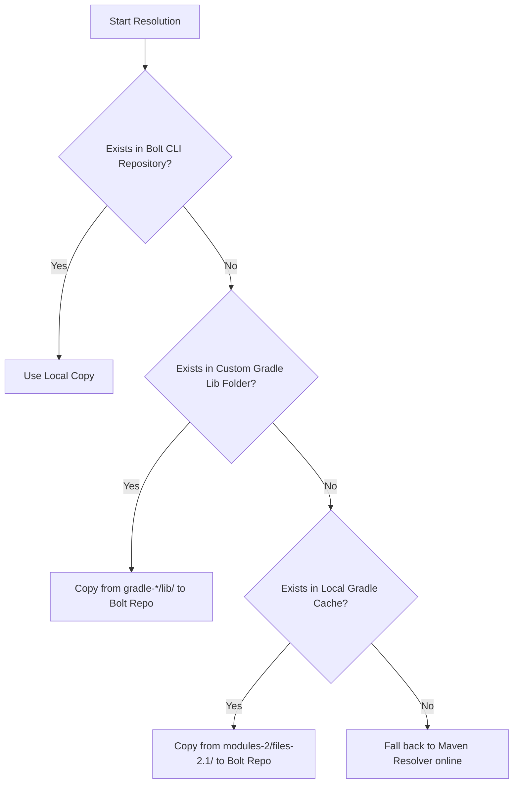
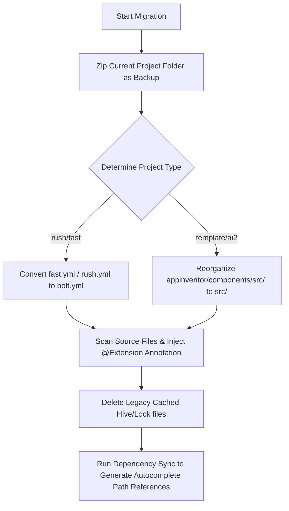
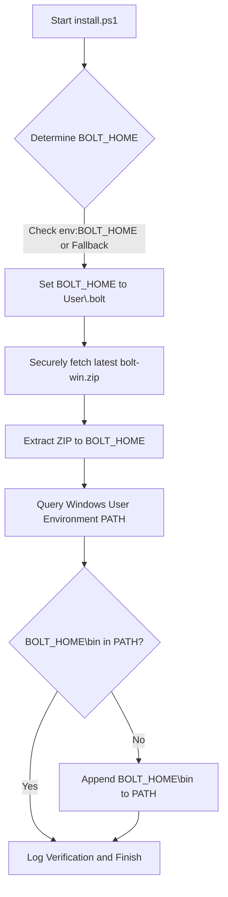
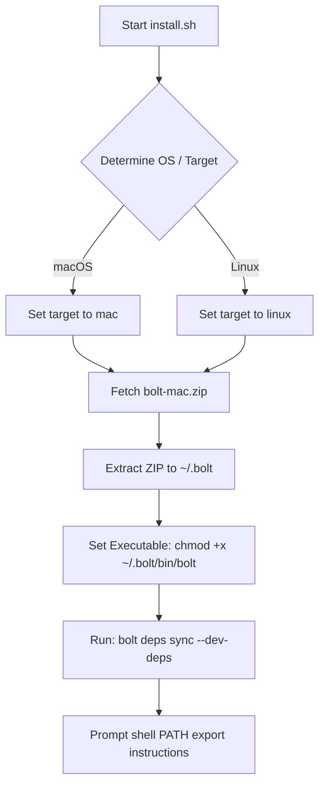

# 🚀 Under the Hood: How Bolt CLI Works

Bolt CLI is built for maximum speed and absolute efficiency when scaffolding, resolving dependencies, and compiling App Inventor extensions. Below is a deep, step-by-step guide explaining exactly how each feature operates under the hood.

---

## ⚡ 1. Persistent Bolt Compiler Daemon & DEX Caching (`bolt daemon`)

1. **Persistent Daemon (`bolt daemon start/stop/status`)**: Bolt CLI maintains a lightweight, background daemon HTTP socket server on port `19090`. The daemon keeps JVM compiler dependencies (`javac`, `kotlinc`, `D8`) loaded and warmed up in RAM, eliminating cold-start process spawning.
2. **Auto-Idle Timeout**: To prevent background RAM waste, the daemon automatically shuts down after 15 minutes of inactivity.
3. **Incremental D8 DEX Caching**: During `bolt build`, Bolt checks `d8TimestampKey` against input bytecode. If source `.class` files haven't changed, D8 DEX generation is safely skipped, reducing incremental build times to **~3 seconds**.

## 🔥 2. Live Hot-Reloading & Monitor (`bolt run`)

Bolt completely bypasses the traditional App Inventor compilation cycle. When you run `bolt run`:
1. It compiles your Java source code into DEX format locally.
2. It spins up a local WebSocket server (Port 9000).
3. The custom **`BoltHotReloader.aix`** extension (which compiles to just 223KB) connects to Bolt CLI via `Java-WebSocket` over Wi-Fi, and the DEX bytes are streamed directly into the phone's memory.
4. **Dynamic DEX Swapping**: When the extension receives the `.dex` payload, it saves it to the cache directory, uses **Java Reflection** to clear the `ReplForm`'s `loadedExternalDexs` internal list, and constructs a new `DexClassLoader` at runtime! This updates your UI components dynamically.
5. Meanwhile, a background thread monitors the Dalvik Heap and sends memory telemetry back to the Bolt CLI, producing a live terminal dashboard!

## 🔐 3. Offline RSA Licensing (`bolt auth`)

1. **Initialization:** Generates an RSA-2048 keypair, saving the private key in `.bolt/private_key.pem` and injecting a `LicenseVerifier.java` containing the public key into the source.
2. **Generation:** Signs a customer's MIT App Inventor email prefix (e.g. `kapil`) using the private key.
3. **Verification:** At runtime, the extension dynamically reads its own Android Package Name (e.g. `appinventor.ai_kapil.MyApp`), strips the `ai_kapil`, and uses the embedded Public Key to cryptographically verify if the License Key was generated specifically for this email prefix!

## 🧪 4. Advanced Tooling & Testing

* **Dependency Manager (`bolt add`)**: Automatically fetches libraries from Maven Central, resolves transitive dependencies via POM parsing, and injects them directly into `bolt.yml`.
* **Dev Sync (`bolt sync dev`)**: Downloads and updates `desugar_jdk_libs:2.1.5` and `desugar_jdk_libs_configuration.json` from Google Maven automatically.
* **Robolectric & JUnit 5 (`bolt test`)**: Instead of needing an emulator, `bolt test` uses Robolectric to stub Android framework classes (like `Context`) locally on your PC, executing JUnit 5 assertions in milliseconds.
* **Native AIDL Support (Auto-Detect)**: Bolt seamlessly scans for Android Interface Definition Language (`.aidl`) files in `src/`. Drop `.aidl` files anywhere in `src/` and Bolt transpiles them to `.java` interfaces automatically during `bolt build` without needing any configuration flag!
* **NDK Size Optimization**: Native C/C++ builds use `c++_static` STL linking and `--strip-unneeded` symbol stripping, reducing compiled `.aix` file size from 4.6MB to **85KB**.
* **Next-Gen Desugaring**: Bolt's D8 integration now seamlessly transpiles bytecode from **JDK 8 up to JDK 25+** to run on older Android runtimes!
* **coreLibraryDesugaring**: By injecting `desugar_jdk_libs`, Bolt allows App Inventor extensions to natively use modern APIs like `java.util.stream` and `java.time` without crashing on Android 7 and below.

---

## 📦 4. The Dependency Resolution Pipeline (Gradle & Maven Resolvers)

When you run `bolt sync` or compile your extension with `bolt build`, Bolt CLI executes a highly optimized, multi-tier dependency resolution pipeline.

### Tier A: Local Cache Resolution (`[Local Only]`) ⚡

To avoid redundant internet downloads and maximize performance, Bolt CLI looks locally *first* before making any HTTP requests.


```mermaid
graph TD
    A[Start Resolution] --> B{Exists in Bolt CLI Repository?}
    B -- Yes --> C[Use Local Copy]
    B -- No --> D{Exists in Custom Gradle Lib Folder?}
    D -- Yes --> E[Copy from gradle-*/lib/ to Bolt Repo]
    D -- No --> F{Exists in Local Gradle Cache?}
    F -- Yes --> G[Copy from modules-2/files-2.1/ to Bolt Repo]
    F -- No --> H[Fall back to Maven Resolver online]
```

#### Step 1: Pre-cached Repository Check
Bolt CLI first checks if the requested artifact coordinates (e.g. `com.example:foo-bar:1.2.3`) already reside in its own dedicated local repository folder under:
`$BOLT_HOME/repository/` (Defaulting to `C:\Users\<Username>\.bolt\repository\`).

#### Step 2: Custom Gradle Tools Folder Lookup
If the artifact is missing from its repository, Bolt CLI checks the user's custom Gradle libs directory:
`$HOME/.bolt/libs/gradle-<version>/lib/` (e.g., `gradle-8.14.5`).
If the requested library exists as a pre-installed tool/jar there, Bolt CLI copies it directly into its active repository, bypassing the network.

#### Step 3: Local Gradle Cache Matching
If still unresolved, Bolt CLI looks for local developer builds. On Windows, macOS, or Linux, it accesses the standard Gradle modules cache directory:
`$HOME/.gradle/caches/modules-2/files-2.1/`
1. It splits the requested relative path to reconstruct the `groupId` (e.g. `com.google.guava`), `artifactId` (`guava`), and `version` (`31.0-jre`).
2. It navigates to `$HOME/.gradle/caches/modules-2/files-2.1/com.google.guava/guava/31.0-jre/`.
3. If the subdirectory exists, it locates the cached `.jar` or `.aar` file, copies it directly to Bolt's local repository, and registers it.

---

### Tier B: Online Transitive Resolution (Maven Resolver) 🌐

If the dependency is not found locally, Bolt CLI spins up its online **Maven Resolver** engine.

#### Step 1: Querying Repositories
Bolt CLI queries the Maven repositories in a precise order of precedence:
1. **Custom Repositories First:** Any repository URLs explicitly specified by the developer in `bolt.yml` under the `repositories:` key.
2. **Default Fallbacks:**
   - **Maven Central** (`https://repo1.maven.org/maven2`)
   - **Google Maven** (`https://dl.google.com/dl/android/maven2`)
   - **JitPack** (`https://jitpack.io`)

#### Step 2: Transitive POM Parsing
Once the artifact file is downloaded, the Maven Resolver doesn't stop there. It automatically fetches the matching Project Object Model (`.pom`) file (e.g. `foo-bar-1.2.3.pom`):
1. It strips out XML comments and parses the POM configuration into a dynamic JSON object.
2. It parses the `<dependencies>` and `<dependencyManagement>` blocks to determine all transitive (child) dependencies.
3. It recursively adds those transitive coordinates back to the resolution queue, downloading and caching them automatically until the entire dependency tree is resolved.
4. It fetches and verifies checksums (`.sha1`, `.md5`, `.sha256`, `.sha512`) to ensure files are completely uncorrupted.

---

## 🎨 2. Assets Directory & Packaging (`assets`)

App Inventor extensions often need to bundle raw static assets (like JSON configurations, fonts, HTML pages, or images).

```text
Project Directory
├── assets/                  <-- Put your raw assets here
│   ├── data.json
│   └── logo.png
├── src/
└── bolt.yml                 <-- Declare them here
```

### Step 1: Declaration in `bolt.yml`
You declare the asset files in the project configuration under the `assets:` key:
```yaml
assets:
  - data.json
  - logo.png
```

### Step 2: Extraction & Copying Pipeline
During `bolt build`:
1. Bolt CLI reads the `assets:` list from the parsed configuration.
2. It checks the `assets/` directory in your project's root.
3. **If it's a file:** It copies the file directly into the raw build directory:
   `build/raw/assets/<filename>`
4. **If it's a folder:** It recursively traverses the entire folder structure and copies all nested files and subfolders into `build/raw/assets/` while fully preserving their relative directory structures.
5. If a declared asset is missing, Bolt CLI throws a descriptive error (`Asset <name> does not exist`) to prevent half-baked builds.

---

## 📄 3. License Bundling (`license`)

To follow open-source guidelines, extensions require proper legal packaging.

### Step 1: Specifying the License
You define your license in `bolt.yml`:
```yaml
license: LICENSE.txt
```
*(You can also specify a hosted web URL, which will be logged as metadata).*

### Step 2: Mapping to `aiwebres`
During compiling:
1. Bolt CLI checks if the `license` parameter is a local file rather than a web URL.
2. If it is a file, Bolt CLI locates the file in the project root.
3. It copies the file to the target build resource path:
   `build/raw/aiwebres/LICENSE`
4. The `aiwebres` folder is a standard App Inventor specification folder. Any license placed here is seamlessly compiled directly into your final `.aix` bundle as a bundled web asset.

---

## ⚔️ 4. Normal Dependencies vs. Provided Dependencies

Choosing how to bundle libraries is crucial for preventing app conflicts.

| Feature | `dependencies` (Normal) | `provided_dependencies` (Compile-time Only) |
| :--- | :--- | :--- |
| **Compilation Classpath** | Yes (Satisfies Java/Kotlin compiler) | Yes (Satisfies Java/Kotlin compiler) |
| **Bundled in AIX?** | **Yes** (Packaged directly in `.aix` bytecode) | **No** (Left out of the final `.aix` file) |
| **Target Runtime** | Self-contained within the extension | Provided by the host App Inventor Companion/Companion APK |
| **Typical Use-case** | Custom third-party helpers, specific libraries | Android SDK tools, App Inventor Core, Support Libraries |

### The "Duplicate Class Conflict" Problem 💥
If you bundle a library (like `support-v4` or Google Play Services) directly into your extension using standard `dependencies`, and the user imports your `.aix` into an App Inventor companion that **already has that library built-in**, a critical conflict occurs.

When App Inventor attempts to compile the user's final `.apk`, the build engine throws a **Dex / ProGuard Exception** due to duplicate class signatures:
```text
Duplicate class com.google.android.gms.internal.common.zzb found in modules...
```

### The Solution: `provided_dependencies` 🛡️
By declaring the library under `provided_dependencies`:
1. **Compile-time Success:** The Java/Kotlin compilers (`javac`/`kotlinc`) are happy because they can reference the library's classes and methods during compilation.
2. **Super-lightweight AIX:** The compiled code is excluded from the `.aix` bundle, keeping it tiny.
3. **Conflict Prevention:** At runtime, the compiled extension safely references the shared libraries already loaded in memory by the App Inventor container/Companion, preventing any duplicate class conflicts!

---

## 🔄 5. Project Migration Pipeline (`bolt migrate`)

To make upgrading from legacy CLI toolkits completely seamless, Bolt CLI features a comprehensive migration engine under `bolt migrate`. It automatically converts legacy configurations, updates source directories, and injects modern compilation rules.


```mermaid
graph TD
    A[Start Migration] --> AB[Zip Current Project Folder as Backup]
    AB --> B{Determine Project Type}
    B -- rush/fast --> C[Convert fast.yml / rush.yml to bolt.yml]
    B -- template/ai2 --> D[Reorganize appinventor/components/src/ to src/]
    C --> E[Scan Source Files & Inject @Extension Annotation]
    D --> E
    E --> F[Delete Legacy Cached Hive/Lock files]
    F --> G[Run Dependency Sync to Generate Autocomplete Path References]
```

### Under the Hood: How the Migration Works

#### Step 1: Automated Zip Backup
Before making any changes to directories or files, Bolt CLI zips the entire current project directory and saves the backup file directly inside the project root directory.
1. The backup file is named `<projectName>_backup_<timestamp>.zip`.
2. To keep the backup size extremely small and optimized, transient caches and huge build folders (like `.git`, `.bolt`, `.dart_tool`, and `.rush`) are automatically filtered out.
3. This creates a secure checkpoint of your legacy project code and configuration before any transformation rules are applied.

#### Step 2: Configuration Conversion
Bolt scans the workspace for legacy setup files. It detects files like `rush.yml` (Rush v1) or `fast.yml` (Fast CLI) and automatically renames and restructures them to conform to the new `bolt.yml` syntax.

#### Step 3: Restructuring and Source Scanning
- For standard App Inventor components or `extension-template` source repositories, the migration restructures the directory layout (moving files from nested `appinventor/components/src` directories to the simplified `src/` directory).
- It parses the main Java/Kotlin source file. If the class extends `AndroidNonvisibleComponent` but is not decorated with the `@Extension` annotation (required in Bolt CLI to declare custom descriptions or icons), it automatically injects this annotation block above your class definition.

#### Step 4: Workspace and Cache Reconciling
All legacy `.hive` and `.lock` databases inside `.bolt/` are cleaned up. Finally, it triggers a dependency synchronization (`sync` task) to re-evaluate the local classpath and automatically inject paths of dependencies into `.vscode/settings.json` so that you have full autocompletion immediately!

---

## 📖 Step-by-Step Migration Examples

You can run `bolt migrate` with positional arguments matching your project source:

### A. Migrating a Rush v1 Project
If your legacy extension was created with Rush v1 (containing `rush.yml` in the root folder), simply open your terminal in the directory and run:
```bash
bolt migrate rush
```
This renames `rush.yml` to `bolt.yml`, keeps your package declarations, and automatically runs `bolt deps sync` to satisfy compilers.

### B. Migrating a Fast CLI Project
If your legacy extension was created with the Fast CLI (containing `fast.yml` in the root folder):
```bash
bolt migrate fast
```
This renames `fast.yml` to `bolt.yml`, maps dependencies correctly, and sets up your project for instant building.

### C. Migrating an Extension Template Project
If you are migrating a traditional, raw `extension-template` project structure:
```bash
bolt migrate template
```
This restructures the directories, moves Java source files from nested subdirectories directly under `src/`, creates a brand new `bolt.yml` file, and injects the `@Extension` annotation.

### D. Migrating an App Inventor Core/Sources Project
If you are importing code directly from a custom App Inventor core component:
```bash
bolt migrate ai2
```
This performs a deep restructure, generating a ready-to-build Bolt CLI extension from raw core component files.

---

## ⚡ 6. Build Time Optimization Pipeline (Bypassing Sync)

To keep developer feedback loops ultra-fast, Bolt CLI separates the slow dependency synchronization phase from typical compiler executions.

### How the Bypass Operates
1. **Regular Builds (`bolt build`)**: When you invoke a standard build, Bolt completely skips executing `SyncCommand`. It proceeds directly to merging manifests, compiling files, and packaging the extension. This keeps build cycles under a few seconds since no redundant online network requests or offline file mapping audits are executed.
2. **Forced Sync during Builds (`bolt build -y` or `bolt build --sync`)**: If you explicitly want dependency synchronization to run during a build (for example, if you manually altered dependencies inside `bolt.yml`), passing the `-y` or `--sync` flag will run the synchronization tasks before starting the compile.
3. **Combined Commands (`bolt sync build`)**: When you execute `bolt sync build`, the command runner intercepts the execution flow. It runs a full dependency sync task first. If the sync task completes successfully (returns exit code `0`), it immediately triggers the `build` command, resulting in a single-step verify-and-build workflow.

---

## 🎨 7. Visual Terminal Error Diagnostic Pipeline (Post-Failure Processing)

When a compiler toolchain (Kotlin, Java, ProGuard, Desugarer, D8, or Manifest Merger) fails, it raises a native process-level `ProcessException`. Bolt intercepts this failure and translates raw stack traces into beautiful, actionable error reports.

### The Interceptor Flow
1. **Interception**: Any compilation exception is routed into `_catchAndStop(Object e, StackTrace s)`.
2. **Matching & Categorization**: The diagnostic engine checks the failing `executable` path and the list of `arguments` passed to find matching tool signatures (e.g. `KaptCli` for Kotlin, `javac` for Java, `proguard` for obfuscation, `d8` for dexing, and `manifest-merger` for manifest compilation).
3. **Actionable Step Resolution**: Each category is mapped to a tailored set of troubleshooting steps. For example, if Java compilation fails due to a lambda expression but `java8` is not enabled, the guide points directly to configuring `java8: true` inside `bolt.yml`.
4. **Vibrant ANSI Borders & Typo Highlighting**: Utilizing the `tint` terminal coloring package, the CLI renders a beautifully styled vertical border box using custom harmonized colors (yellow for Kapt, red for Java compiler, cyan for ProGuard, magenta for desugaring, and bright yellow for manifest issues) to isolate the error.

---

## 🚀 8. Advanced Build Enhancements (Desugaring, Relocation, & Minimization)

Bolt CLI handles advanced Java bytecode orchestration to ensure seamless compatibility on older Android devices and prevent dependency collisions.

### Core Library Desugaring (JDK 8-25+)
Modern APIs like `java.time.*` are not natively available on older Android SDKs. When `coreLibraryDesugaring: true` is set in `bolt.yml`:
1. Bolt bypasses the legacy standalone `desugar.jar`.
2. It passes the `desugar_jdk_libs_configuration.json` rule set directly to the **D8 compiler**.
3. D8 natively rewrites the Java 17+ bytecode and injects the `j$.time.*` replacements during the DEX generation.
4. Bolt automatically bundles the `desugar_jdk_libs.jar` polyfill inside your extension's `.dex` file so it runs completely standalone!

### Dependency Relocation (Shading) via JarJar
To prevent `NoClassDefFoundError` or `DuplicateClass` conflicts when multiple extensions bundle the same libraries (like Guava or OkHttp):
1. Setting `relocation.EnableAutoRelocation: true` triggers `JarJar`.
2. Bolt dynamically creates `jarjar_rules.txt` rules translating `org.yourdep.**` into `<your.package>.repacked.org.yourdep.**`.
3. The relocation happens on `AndroidRuntime.jar` *before* ProGuard obfuscation, isolating your dependencies safely.

### ProGuard Minimization Exclusions
To stop ProGuard from stripping classes that are only loaded via reflection:
1. When a user defines a maven coordinate under `minimize.exclude_dependency` (e.g., `org.slf4j:slf4j-simple:.*`),
2. Bolt automatically parses the `groupId` (`org.slf4j`) and injects `-keep class org.slf4j.** { *; }` and `-dontwarn` rules directly into the ProGuard execution pipeline.

---

## 🚀 9. Live Hot-Reloading (`bolt run` & UDP Discovery)

Bolt CLI offers an unprecedented developer experience with instant hot-reloading using the **Bolt Companion App**.

### The `bolt run` Pipeline
1. **WebSocket Server**: When you execute `bolt run`, Bolt spins up a high-performance local WebSocket server on your machine (default port 9000).
2. **UDP Auto-Discovery**: Simultaneously, it starts a UDP listener on port 9001. When the mobile Companion App broadcasts a `BOLT_DISCOVER` packet over the local Wi-Fi, the CLI instantly replies with its IP address and WebSocket port.
3. **File Watching**: Bolt intelligently monitors your `src/` directory for any changes to Java, Kotlin, or C++ files.
4. **On-the-Fly Dexing**: Upon detecting a file save, Bolt recompiles the specific classes, runs D8 to generate a `.dex` file, and pushes the raw byte stream directly over the WebSocket to the mobile device.
5. **Dynamic Class Loading**: The Companion App receives the byte stream, saves it to the Android cache, and uses `DexClassLoader` to inject the new logic directly into the running application memory, bypassing the need to ever build or install an APK manually!

---

## ⚙️ 10. Native C/C++ (JNI & NDK) Compilation

Bolt fully integrates with the Android Native Development Kit (NDK) to compile shared C/C++ libraries (`.so`) alongside your Java/Kotlin extension code.

### Execution Flow
1. **Trigger**: When `ndk: enabled: true` is set in `bolt.yml`, the NDK compilation phase is activated during `bolt build`.
2. **Path Resolution**: Bolt automatically locates your local Android SDK and nested `ndk/` directory. It defaults to the highest installed NDK version unless specifically overridden.
3. **CMake/ndk-build**: Bolt invokes the `ndk-build` script, passing it the path to your `jni/Android.mk` and `jni/Application.mk` configuration files.
4. **ABI Architecture Compilation**: The C/C++ source code is compiled down to machine code for various architectures (e.g., `armeabi-v7a`, `arm64-v8a`, `x86_64`) based on your `Application.mk`.
5. **Bundling**: The resulting `.so` library files are cleanly packaged into the root of the generated `AndroidRuntime.jar` so App Inventor extracts and maps them automatically at runtime.

---

## 🧪 11. Unit Testing Pipeline (`bolt test`)

Bolt CLI integrates **JUnit 5** to provide a seamless testing environment for your extensions directly in your terminal, without needing an Android device or emulator.

### The Execution Flow
1. **Compilation**: When you run `bolt test`, Bolt first compiles your extension's main source code (`src/`). Then it locates your `test/` directory and compiles your test classes against the generated bytecode and any `test_dependencies` defined in `bolt.yml`.
2. **Classpath Resolution**: It dynamically generates a unified Java classpath including your test bytecode, extension bytecode, required standard dependencies, and the JUnit 5 platform dependencies (like `junit-jupiter-api` and `junit-platform-console-standalone`).
3. **Execution**: Bolt invokes the `ConsoleLauncher` from the JUnit platform, isolating execution to ensure your test code doesn't interfere with the global JVM state.
4. **Reporting**: The test results, including failures, passed tests, and stack traces, are rendered cleanly in the console output. 

---

## 🛠️ 12. Environment PATH Configuration, Layouts & Release Packaging for All Platforms

This section outlines how installers configure environment paths, where files are saved, and how to package release ZIP assets on GitHub for Windows, Linux, and macOS.

### 🔌 A. Windows PATH Auto-Configuration Mechanics

The Windows PowerShell installer (`scripts/install/install.ps1`) is designed to download, extract, and automatically add the Bolt CLI binary to the Windows User PATH variable if it doesn't already exist.


```mermaid
graph TD
    A[Start install.ps1] --> B{Determine BOLT_HOME}
    B -->|Check env:BOLT_HOME or Fallback| C[Set BOLT_HOME to User\.bolt]
    C --> D[Securely fetch latest bolt-win.zip]
    D --> E[Extract ZIP to BOLT_HOME]
    E --> F[Query Windows User Environment PATH]
    F --> G{BOLT_HOME\bin in PATH?}
    G -->|No| H[Append BOLT_HOME\bin to PATH]
    G -->|Yes| I[Log Verification and Finish]
    H --> I
```

#### Step-by-Step Installer Stages:
1. **Verification**: Assures the host operating system is Windows NT.
2. **Home Folder Selection (`$BoltHome`)**: Resolves the installation folder path:
   - Priority 1: User explicitly provided path parameter (`-InstallPath`).
   - Priority 2: `$env:BOLT_HOME` environment variable.
   - Priority 3: The existing directory parent of `bolt.exe` if present.
   - Priority 4: Default fallback path `%UserProfile%\.bolt`.
3. **ZIP Retrieval**: Secures connection protocols to TLS 1.2 and fetches the latest `bolt-win.zip` asset using `Invoke-WebRequest` to `$BoltHome\bolt-win.zip`.
4. **Extraction**: Unzips files using `Expand-Archive` or `.NET` framework compression utilities.
5. **Java dependencies sync (Optional Prompt)**: Prompts the developer to download essential compilation libraries (approx. 170MB). If approved, it calls the newly extracted Bolt CLI binary to execute the sync command:
   ```powershell
   & "$BoltHome\bin\bolt.exe" deps sync --dev-deps --no-logo
   ```
   *Note: Corrected a critical scoping bug where skipping the dependencies prompt previously crashed the installer script due to an undefined binary folder variable.*
6. **Automatic PATH Update**:
   - Safely queries the current Windows User environment scope using `[EnvironmentVariableTarget]::User`.
   - Performs a case-insensitive, structured check: if the path `%;%UserProfile%\.bolt\bin;%` is absent, it securely appends `;$BoltHome\bin` and writes the update back to the Windows registry.
   - Updates the current PowerShell process environment variable `$Env:Path` so the `bolt` command is instantly available without needing to restart the shell.

---

### 🔌 B. Linux & macOS PATH Configuration Mechanics

The Unix shell installer (`scripts/install/install.sh`) downloads the binary archive, unpacks it into `$HOME/.bolt`, sets execute permissions, and prompts the developer to update their shell profile path.


```mermaid
graph TD
    A[Start install.sh] --> B{Determine OS / Target}
    B -->|macOS| C[Set target to mac]
    B -->|Linux| D[Set target to linux]
    C --> E[Fetch bolt-mac.zip]
    D --> E
    E --> F[Extract ZIP to ~/.bolt]
    F --> G[Set Executable: chmod +x ~/.bolt/bin/bolt]
    G --> H[Run: bolt deps sync --dev-deps]
    H --> I[Prompt shell PATH export instructions]
```

#### Step-by-Step Installer Stages:
1. **Target Detection**: Determines the platform target via `uname -sm`:
   - macOS (Intel/Silicon) $\rightarrow$ `mac` (downloads `bolt-mac.zip`).
   - Linux (x86_64) $\rightarrow$ `linux` (downloads `bolt-linux.zip`).
2. **ZIP Retrieval & Extraction**: Downloads the asset to the `$boltHome` directory (typically `~/.bolt`), extracts it, and removes the zip file.
3. **Execute Permissions**: Runs `chmod +x "$boltHome/bin/bolt"` to make the native Bolt binary executable.
4. **Java Dependencies Sync**: Prompts the developer to sync dependencies, executing:
   ```bash
   "$boltHome/bin/bolt" deps sync --dev-deps --no-logo
   ```
5. **PATH Update Instructions**: Detects the default shell via `$SHELL` and instructs the user to append the export path:
   - For `/bin/zsh`: Tells the user to add `export PATH="$PATH:$HOME/.bolt/bin"` to their `~/.zshrc`.
   - For other shells (e.g. bash): Tells the user to add the export statement to `~/.bash_profile` or `~/.bashrc`.

---

### 📦 C. Packaging the `.zip` Release Assets for GitHub

Release archives must contain the compiled executable binary and the required libraries. They are named `bolt-win.zip`, `bolt-linux.zip`, and `bolt-mac.zip`.

#### Step 1: Compile the Native CLI Binary
Run Dart compilation inside the project root on the target platform (cross-compilation is not supported natively in Dart):
* **Windows:**
  ```powershell
  dart compile exe bin/bolt.dart -o bolt.exe
  ```
* **Linux / macOS:**
  ```bash
  dart compile exe bin/bolt.dart -o bolt
  ```

#### Step 2: Compile the Annotation Processor
Compile the shadow JAR inside the `processor` Gradle project:
```bash
cd processor
./gradlew :processor:shadowJar
```
This produces `processor/processor/build/libs/processor-<version>.jar`.

#### Step 3: Download Core Java Jars (Provided Dependencies)
The `libs/` directory inside the zip must contain the following App Inventor core libraries for off-line compilation support:
- `kawa.jar` (MIT App Inventor customized Kawa jar)
- `physicaloid.jar` (Physicaloid serial communication jar)
- `webrtc.jar` (WebRTC support library)
- `mpandroidchart.jar` (Graph rendering support library)
- `osmdroid.jar` (OpenStreetMap utility library)
- `android-35.jar` (Android API Level 35 SDK platform jar)

#### Step 4: Assemble the Release Folder Directory Structure
Create a temporary directory matching this exact structure:
```text
bolt-<platform>/
├── bin/
│   └── bolt (or bolt.exe on Windows)       <-- Compiled native binary
└── libs/
    ├── android-35.jar
    ├── kawa.jar
    ├── mpandroidchart.jar
    ├── osmdroid.jar
    ├── physicaloid.jar
    ├── webrtc.jar
    └── tools/
        └── processor.jar                   <-- Compiled ExtensionProcessor shadow JAR
```
> [!IMPORTANT]
> The folder directories `bin` and `libs` must reside directly at the root of the ZIP file. Do not wrap them inside another nested parent directory.

#### Step 5: Compress the Folder to `.zip`
Compress the temporary directory to `bolt-win.zip`, `bolt-linux.zip`, or `bolt-mac.zip` and upload them to the GitHub release.

---

### 💾 D. Extraction and Toolchain Layout Locations

When Bolt CLI is fully installed, its executable, tools, and cache repository reside in the following system paths:

#### Windows:
* **Executable Location**:
  `%UserProfile%\.bolt\bin\bolt.exe` (e.g. `C:\Users\<Username>\.bolt\bin\bolt.exe`)
* **Core Libraries & Annotation Processors Location**:
  `%UserProfile%\.bolt\libs\tools\processor.jar`
* **Provided Java Libraries Directory**:
  `%UserProfile%\.bolt\libs\` (contains `kawa.jar`, `webrtc.jar`, `android-35.jar`, etc.)
* **Local Maven Cache Location**:
  `%UserProfile%\.bolt\repository\`

#### Linux & macOS:
* **Executable Location**:
  `~/.bolt/bin/bolt` (e.g., `/home/username/.bolt/bin/bolt` or `/Users/username/.bolt/bin/bolt`)
* **Core Libraries & Annotation Processors Location**:
  `~/.bolt/libs/tools/processor.jar`
* **Provided Java Libraries Directory**:
  `~/.bolt/libs/` (contains `kawa.jar`, `webrtc.jar`, `android-35.jar`, etc.)
* **Local Maven Cache Location**:
  `~/.bolt/repository/`

---

## 🛡️ 13. String Obfuscation Pipeline (StrGuard)

Bolt CLI integrates **StrGuard**, a powerful bytecode-level string obfuscation tool, to protect hardcoded strings (like API keys, endpoint URLs, and sensitive logic) in your App Inventor extensions.

### Configuration
You enable and configure StrGuard inside your `bolt.yml`:
```yaml
strguard:
  enabled: true
  key: "MyEncryptionKey"
  packages:
    - "com.myextension"
```

### Step-by-Step Execution Flow
When you run `bolt build`, the obfuscation happens seamlessly under the hood:

#### Step 1: Java/Kotlin Compilation
Bolt CLI first compiles all your source files (`.java` and `.kt`) into standard `.class` bytecode files using `javac` and `kotlinc`. These compiled files are temporarily stored in the build directory (`.bolt/build/classes/`).

#### Step 2: Triggering StrGuard
Immediately after successful compilation (and *before* any DEX generation, ProGuard shrinking, or `.jar` packaging), Bolt CLI checks your `bolt.yml`. If `strguard.enabled` is `true`, it triggers the StrGuard pipeline.

#### Step 3: Bytecode Analysis and Transformation (ASM)
Bolt CLI executes the bundled `strguard.jar` (powered by the ASM bytecode manipulation framework) against your compiled `.class` files.
1. **Targeting**: StrGuard scans the classes belonging only to the packages you specified in the `packages` list (e.g., `com.myextension`).
2. **Detection**: It locates all `LDC` (Load Constant) instructions in the bytecode that load plain-text `String` objects (e.g., `"My Secret Token"`).
3. **Encryption**: It encrypts each detected string using a highly secure XOR-based algorithm, utilizing either the custom `key` you provided or a securely auto-generated hardware-tied key.
4. **Bytecode Modification**: The original `LDC` instructions containing the plain-text strings are completely wiped from the bytecode. They are replaced with a series of byte array (`newarray byte`) initialization instructions and a static method call (`invokestatic`).

#### Step 4: Runtime Decoding Injection
StrGuard injects a tiny decoder class (`StrGuardImpl`) into your compiled bytecode. At runtime, when your extension is loaded in an App Inventor app, the injected bytecode dynamically reconstructs the encrypted byte arrays back into the original strings exactly when they are needed.

#### Step 5: Final Packaging
Once the StrGuard execution finishes modifying the `.class` files in place, Bolt CLI proceeds to package these obfuscated classes into `AndroidRuntime.jar` and eventually converts them into Dalvik bytecode (`classes.dex`). 

Because the plain-text strings were wiped before packaging, reverse-engineering your final `.aix` extension using tools like `jadx` or `CFR` will only reveal meaningless byte arrays and a decoder function, keeping your sensitive strings safe from prying eyes!
